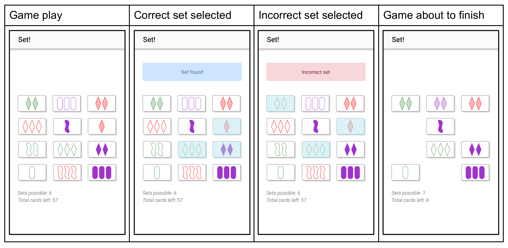

# Set - Tandem Frontend Engineer Test

Engineers at Tandem are expected to plan, execute, and deliver new features as well as maintain our existing applications. The objective of this test is to evaluate how you do the same in a small and fun way.

## Introduction

In this repo you will find the base for an application that, with your help, will house a simple game called [_Set_](https://en.wikipedia.org/wiki/Set_(game)).

The application has been set up using [`create-react-app`](https://github.com/facebook/create-react-app) and already contains a few views.

To view what exists and run the application for development use:

```
yarn start
```

We have also set up some very simple tests which you can run with:

```
yarn test
```

## What we expect

Our application is still in a very early stage and we are looking to build the core functionality of the game and at the same time improve our overall codebase and testing practices.

We expect you to implement the screens and functionality described below using the tools and best-practices that help frontend engineers build scalable and maintainable products.

The codebase has the minimal dependencies required to run a React application, but we haven't decided on a few things.

* Should we use `PropTypes` or some sort of static type checking like Flow or TypeScript?
* Should we use a linter or formatter and if so what is the best configuration?
* Should we invest in some form of style pre-processing? Are `classNames` and CSS variables (our current setup) enough?
* How should we handle game state?
* How can we test components and code in an isolated manner?

Before you implement any functionality we expect you to review the code and think of answers and (if applicable) solutions to these issues as you implement your code.

We expect you to use and follow the best-practices already found in the project as well as defining your own or refactoring any code you think should be improved.

As you progress on solving the questions above and implementing the required views and components we expect you to use **git** to show incremental changes that will allow us to understand your decisions better through the commit history.

## Task Submission

Once your are finished we expect you to create a Merge Request documenting your decisions and explaining how you implemented the new features.

This Merge Request will be reviewed by the team and we will have a feedback session to talk more about your proposed solutions and decisions taken while implementing the new features.

## Set

Set is a popular card game about visual perception. The objective is to identify 'sets' of three cards from 12 cards laid out on the table.

The [official rules of Set](https://www.setgame.com/sites/default/files/instructions/SET%20INSTRUCTIONS%20-%20ENGLISH.pdf) can be found at their website. There are also [many videos on YouTube](https://www.youtube.com/results?search_query=set+card) explaining how to play Set.

### Rules of Set

A deck of Set consists of 81 cards varying in four features: number (one, two, or three); symbol (diamond, squiggle, oval); shading (solid, striped, or open); and color (red, green, or purple). Each possible combination of features (e.g., a card with three striped green diamonds) appears precisely once in the deck.

To get the hang of the Set rules, try playing a couple of Set “puzzles” published in [The New York Times](https://www.nytimes.com/puzzles/set). These puzzles are limited to 9 or 12 cards. The objective is to find all the sets among those cards.

Your task is to develop the game play components and functionality of our own version of Set, with some small differences:

1. No score will be kept. Instead, the objective of the game will be to find all the possible sets in the fastest time possible.

2. Because no score is kept, there will not be any penalties for calling an incorrect set.

3. If it is not possible to create a set with the cards laid out:
    * The cards “on the table” will be returned to the deck
    * The deck will be shuffled
    * 12 new cards will be laid “on the table”.

### Implementation

The application already contains the placeholder view where the game should be implemented, the `/play` route, defined by the `src/pages/Play` component.

As soon as a user enters this screen, and new game of set should be initialized, and the clock starts ticking. The user will be able to select/unselect cards. When they select three cards, the cards are automatically checked if they are a proper set.

If the selected cards are indeed a set, a success notification is displayed for three seconds, and then fades away. At the same time, the selected cards are replaced with three new cards. These new cards need to placed at the same position the old cards were.

If the selected card are not a set, then an error notification is displayed and the selected cards can be unselected. The notification should be displayed for three seconds and then fade away.

It may happen that the cards on the table make it impossible to create a set. If this happens, open a modal notifying the user about this. In the modal should be a button that when clicked does the following:

1. The cards “on the table” are returned to the deck
2. The deck is shuffled
3. 12 new cards will be laid “on the table”
4. The modal is closed
5. Game play continues

The game ends when there are no cards left in the deck and it is impossible to form a set. In this moment the player wins. The time in seconds the game lasted is displayed on the screen. The user can start a new game, or go to the home page.

At any time, the total count of cards left (the sum of cards laid on the table and cards on the deck) and the count of possible sets (with the cards on the table) should be displayed.




### Assets

In the `assets` dir you can find all the design related resources required to work with the application. This includes the icons used for cards which are provided in a font and svg format.

### Suggestions

Start with pen and paper. Pouring your thoughts to code is hard. However, paper is a great medium to write, scribble, draw, and explore ideas.

It’s okay to use libraries/modules. Examples of acceptable libraries: Redux, lodash, etc. Examples of unacceptable libraries: Anything that solves Set. Anything that implements modals, notifications. Anything that provides you with simple utility functions you are expected to be able to code yourself.

This app has been designed with a small screen in mind. However, an example of how the design scales to larger screen has been provided in the assets. It should serve you as a guideline. When the large screen example does not answer any doubts you may have about how the design should scale, use your own judgement and make the best decision possible.

It is possible the description for this challenge does not provide 100% of the details needed for you to provide a perfect solution. However, just like in real life, you should first use your best judgement to make a decision but if you are still in doubt, do write us a reply to the email where you received this challenge and we will provide an answer.

### Bonus points

If you want to get some bonus points, we'd love to see some integration tests, CI deployment, or any other upgrade you think could make the application and it's development better.
